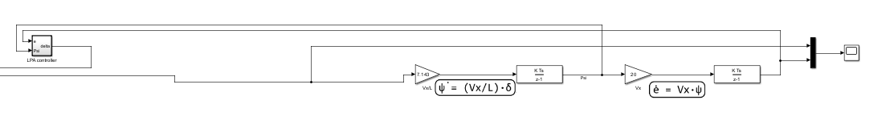
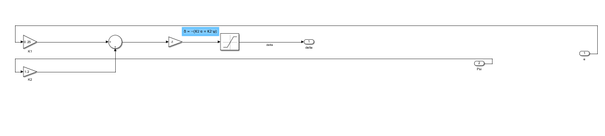
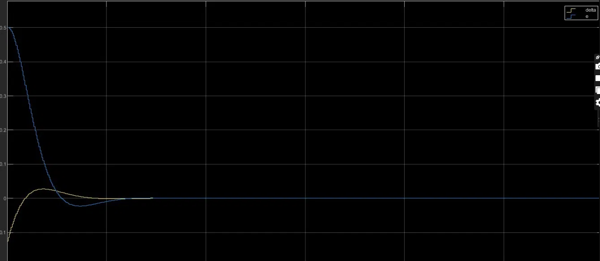
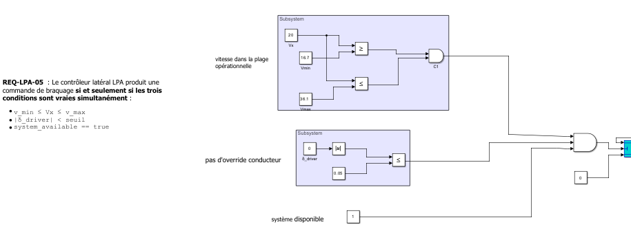
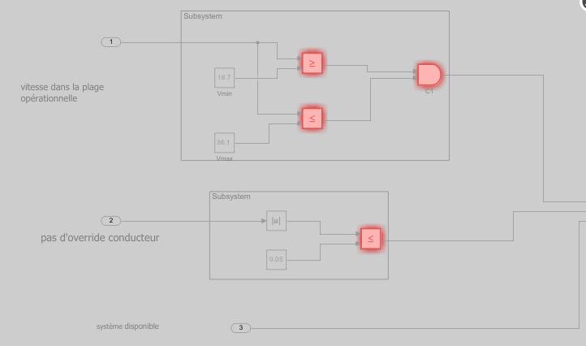

# LPA — Lane Position Assist : conception fonctionnelle & vérification (MBD)

Fonction ADAS de **maintien de voie (Lane Position Assist)** conçue en Model-Based Design
sous MATLAB/Simulink R2024a : spécification → modèle fonctionnel → vérification formelle
(Design Verifier) → couverture modèle → harnais SIL back-to-back.

Projet personnel — Anas Abid. Démontre une chaîne MBD complète **spec → modèle → vérif**
sur une fonction ADAS lattérale type, pas une simple maquette de contrôle.

---

## 1. Vue d'ensemble



Boucle fermée : `LPA controller` → plant vélo (bicycle model) discret → retour `e`, `ψ`.

**Loi de commande** (`δ = −(K1·e + K2·ψ)`, saturée ±0.5 rad) :



| Élément | Valeur | Rôle |
|---|---|---|
| K1 | 0.25 | gain sur l'erreur latérale `e` |
| K2 | 1.2 | gain sur le cap `ψ` — **terme d'amortissement** : pondère plus le cap/yaw que l'offset latéral pour éviter l'oscillation |
| Saturation | ±0.5 rad | limite physique de braquage |
| Plant | `ψ̇ = (Vx/L)·δ`, `ė = Vx·ψ` | bicycle model, intégrateurs discrets `K·Ts/(z−1)` |
| Vx, L | 20 m/s, ≈2.8 m | point de fonctionnement |

**Réponse boucle fermée** — `e` (0.5 → 0) et `δ` convergent ; léger dépassement maîtrisé :



> Note : en boucle fermée nominale, `δ` reste autour de ±0.1 rad — **la saturation ±0.5 ne
> se déclenche jamais**. Ce point est central pour lire la couverture (§3).

---

## 2. Spécification — logique d'activation

**REQ-LPA-05** : le contrôleur latéral produit une commande de braquage **si et seulement si
les trois conditions sont vraies simultanément** :

- `v_min ≤ Vx ≤ v_max` (16.7 ≤ Vx ≤ 36.1 m/s)
- `|δ_driver| < seuil` (seuil = 0.05) — pas d'override conducteur
- `system_available == true`



Les trois conditions sont combinées par un `AND` ; un `Switch` route la sortie du contrôleur
ou 0 selon le résultat. Sortie traçable directement vers la spec.

---

## 3. Vérification — l'histoire des trois analyses

Trois analyses indépendantes **convergent sur le même point** : le bloc de saturation.

### a. Simulink Design Verifier — `verification/sldv/lpa1_sldv_report.pdf`
- **22 / 24 objectifs satisfaits** (92 %).
- 2 objectifs **undecided** (#22, #23) : `Saturation: input ≥ lower limit = false` et
  `input > upper limit = true`.



### b. Couverture modèle — `verification/coverage/`
- **Decision : 63 % (5/8)** — `lpa1_active_cov.html`
- **Condition : 100 % (16/16)**
- **MCDC : 100 %** sur la logique d'activation — `lpa1_active_covMCDC.html`
- Le déficit Decision tombe **exactement** sur les sorties de décision de la saturation.

### c. Harnais SIL back-to-back — `model/lpa1_SIL_harness.slx`
- Même déficit observé en SIL.

### Lecture honnête du résultat (pas de claim "dead logic")
Les objectifs de saturation sont **undecided, pas unsatisfiable**. Ce n'est pas de la logique
morte : c'est que l'analyse formelle est *computationally expensive* sur les bornes de
saturation (elle a manqué de temps), et qu'en parallèle la boucle fermée ne pousse jamais `δ`
au-delà de ±0.5, donc ces sorties ne sont pas exercées en run nominal. Distinction clé :
- **Satisfied** : un cas de test exerce l'objectif.
- **Undecided** : l'outil n'a pas tranché (budget temps) — ≠ inatteignable.
- **Unsatisfiable** : prouvé inatteignable (= dead logic). **Ce n'est PAS le cas ici.**

> MCDC = NA sur le contrôleur de base est correct : la loi est purement arithmétique, sans
> logique booléenne composée, donc aucun objectif MCDC à mesurer. NA n'est pas un échec.

---

## 4. Correspondance avec les exigences du poste (ADAS Technical Functional Designer)

| Ligne JD | Artefact dans ce repo |
|---|---|
| Spécifications fonctionnelles ADAS (ex. LPA) | REQ-LPA-05, §2 |
| Modèles fonctionnels MATLAB/Simulink à partir de spec | `model/lpa1.slx` |
| Design Verifier + MCDC pour valider la couverture | `verification/sldv/`, `verification/coverage/` |
| Intégration MIL / SIL | `model/lpa1_SIL_harness.slx` (back-to-back) |
| KPI / analyse de réponse | §1, réponse boucle fermée |


---

## Structure

```
.
├── model/
│   ├── lpa1.slx                 # modèle fonctionnel + plant + activation
│   └── lpa1_SIL_harness.slx     # harnais SIL back-to-back
├── verification/
│   ├── sldv/lpa1_sldv_report.pdf
│   └── coverage/
│       ├── lpa1_active_cov.html      # Decision/Condition
│       └── lpa1_active_covMCDC.html  # MCDC activation
└── docs/img/                    # captures modèle + résultats
```

**Outils** : MATLAB/Simulink R2024a · Simulink Design Verifier · Simulink Coverage · Embedded Coder · Simulink Test
